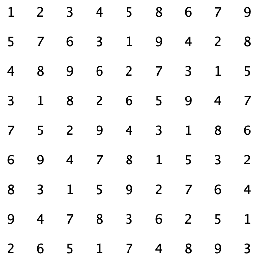

# SudokuSolver
#### A stack-based sudoku solver that utilizes a depth-first search algorithm. Everything implemented myself including the stack data structure with the exception of LandscapeDisplay.java.

&nbsp;

To run the SudokuSolver with a random board of 12 initial value, run in the terminal:
```
git clone https://github.com/JunnanShimizu/SudokuSolver.git
```
```
cd SudokuSolver
```
```
javac Sudoku.java
```
```
java Sudoku.java
```

Examples:

 

Note: These images are not from the same run of Sudoku.
